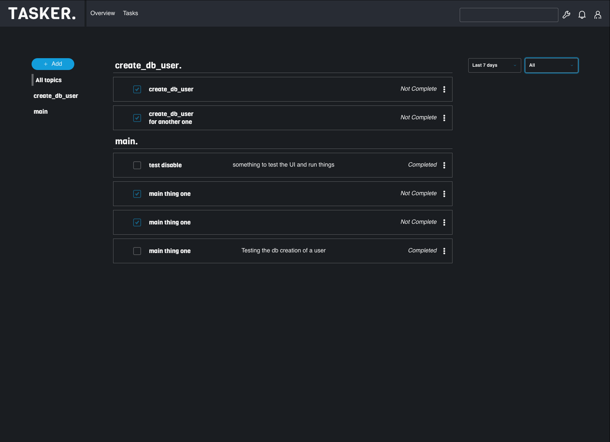

<p align="center">
    
</p>

# Tasker - [ DEVELOPMENT IN PROGRESS ]

Tasker is a job scheduling service that utilizes `go-cron`. Tasker is a service that will allow for dynamic configration of tasks.

Tasker is inspired by the Android application `tasker` the ability to set scripts and schedule them at whim without needing to touch the server code.



# Installation

Import tasker:

```bash
    import "github.com/roger-king/tasker"
```

Install via Go Modules:

```bash
    go mod vendor
```

# Getting Started:

Tasker is simple to get started. Tasker has 2 goals at mind:

- Create a schedule for task to run external scripts
- Create your own handler functions to programmatically run code

```golang
    t := tasker.New()
	router := t.Start()

    // Add to your HTTP Server
	http.Handle("/", router)
	http.ListenAndServe(":8080", nil)
```

Go to your server and find the tasker web client at `/tasker/admin`.

## Configuration of your server

Tasker utilizes [`12 Factor App configs`](https://12factor.net/config). Tasker relies environment variables to handle configruation of the application

Below are the availble of environment variables that Tasker looks for (note: prefixed with `TASKER_`):

| ENV                      |                        Description                         |
| ------------------------ | :--------------------------------------------------------: |
| TASKER_DB_CONNECTION_URL |                    mongo connection uri                    |
| TASKER_PLUGIN_DIR        | root direction where your compiled go plugins can be found |

## TODOS:

View the Github Projects board: https://github.com/roger-king/tasker/projects/1
